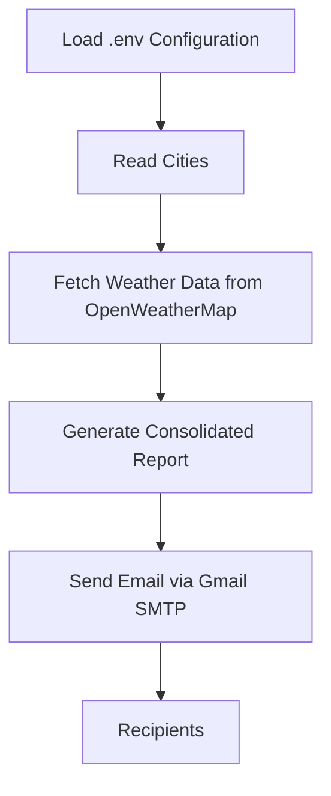

# 🌤️ Weather Email Automation

A Python automation project that fetches real-time weather data for multiple cities using the OpenWeatherMap API and sends a consolidated weather report via email. Designed to be lightweight, configurable, and ready for automation using Windows Task Scheduler or Cron.

---

## 🚀 Project Highlights

- 🌍 Fetches real-time weather data for multiple cities
- 📧 Sends a single consolidated email report
- 👥 Supports multiple recipients
- 🔒 Secure configuration using environment variables (`.env`)
- ⏰ Ready for automation with Task Scheduler or Cron

---

## ✨ Features

- 🌍 Fetch weather for multiple cities
- 📧 Send one consolidated email report
- 👥 Support multiple email recipients
- 📊 Detailed weather information (temperature, feels like, humidity, pressure, wind speed, and weather condition)
- 📝 Logging for execution tracking
- ⚠️ Robust error handling
- 🔒 Secure configuration using `.env`

---

## 🏗️ Workflow



---

## 🛠️ Tech Stack

| Technology | Purpose |
|------------|---------|
| Python | Core Programming |
| Requests | API Communication |
| python-dotenv | Environment Variable Management |
| SMTP (Gmail) | Email Delivery |
| OpenWeatherMap API | Weather Data |

---

## 📂 Project Structure

```text
auto_weather_email/
│
├── email_weather.py
├── requirements.txt
├── README.md
├── .env.example
├── .gitignore
└── logs/
```

---

## 🚀 Getting Started

### 1. Clone the Repository

```bash
git clone https://github.com/adskrk/auto_weather_email.git
cd auto_weather_email
```

### 2. Create a Virtual Environment

```bash
python -m venv .venv
```

Activate the virtual environment:

**Windows**

```bash
.venv\Scripts\activate
```

**Linux / macOS**

```bash
source .venv/bin/activate
```

### 3. Install Dependencies

```bash
pip install -r requirements.txt
```

### 4. Configure Environment Variables

Create a `.env` file using `.env.example` as a reference.

```env
OPENWEATHER_API_KEY=your_api_key
EMAIL=your_email@gmail.com
EMAIL_PASSWORD=your_app_password
RECIPIENTS=user1@gmail.com,user2@gmail.com
CITIES=Hyderabad,Chennai,Bengaluru
```

### 5. Run the Project

```bash
python email_weather.py
```

---

## 📧 Sample Email Report

```text
Weather Report

📍 Hyderabad
🌡 Temperature : 31°C
🤗 Feels Like  : 34°C
💧 Humidity    : 68%
🌬 Wind Speed  : 4.3 m/s
🌥 Condition   : Broken Clouds

---------------------------------

📍 Chennai
...
```

---

## 🔒 Security

Sensitive information is **never committed** to GitHub.

Ignored files include:

- `.env`
- `.venv/`
- `logs/`

---

## 💡 Future Improvements

- HTML email formatting
- Weather forecast support
- Automatic scheduling
- Severe weather alerts
- Docker support
- GitHub Actions (CI/CD)
